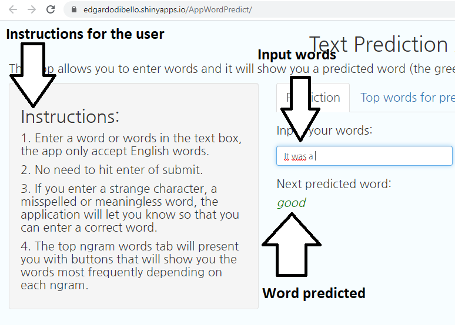

```{r setup, include=FALSE}
knitr::opts_chunk$set(echo = FALSE)
```

## Overview

This presentation is done as the last step of the capstone project for the John Hopkins University data science specialization course given on Coursera.

The purpose of this project is to create an application capable of predicting the next word in relation to what the user enters, the use of natural language processing was needed in addition to all the knowledge acquired in the course.

The application is built in the Shiny environment in Rstudio.

My app can be found here: https://edgardodibello.shinyapps.io/AppWordPredict/

Here you can see the code and files related to the project: https://github.com/EdgardoDiBello/Data-Science-Capstone-Project

## Working with the data and the model

For this project we work with the data collected in English from twitter, news sites and blogs, the data needs to be read, transformed and cleaned.
To clean the data, i do the following:

- Delete the punctuations.
- Eliminate the numbers.
- Remove special characters, url, hashtags and twitter mentions.
- Eliminate bad words
- change everything to lowercase and remove multiple spaces.

For the prediction algorithm, the completely clean data was used to create prediction n-gram models, four n-gram models were created bigram, trigram, quadram and quintgram for the prediction of the words.


## About the app

Using the application is very simple, you just have to enter the desired words in the space shown, when entering them it will take a few seconds to show the prediction. In case a misspelled word is entered, the application will show that you need to enter a correct word, you do not need to press enter as the words will appear by themselves when you finish typing.

The application also has the graphics of the most frequent word combinations within the data.

## Example of the app




